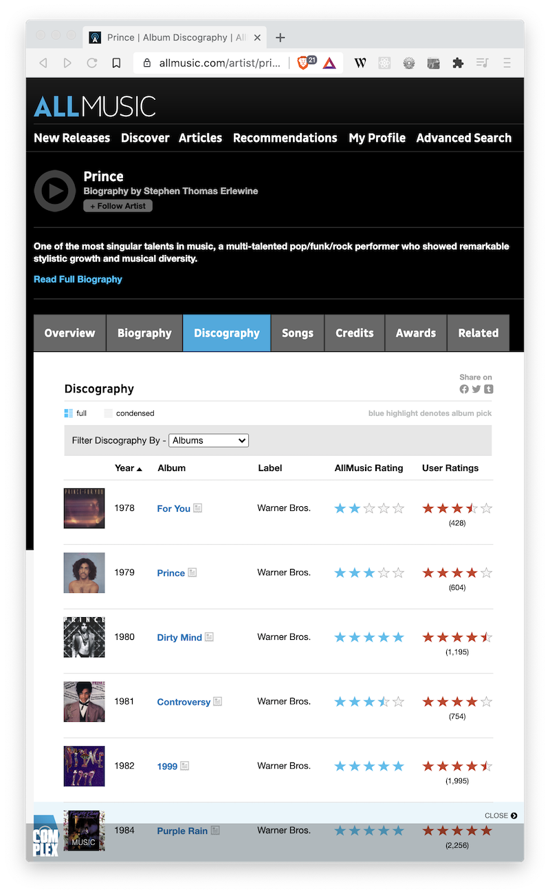
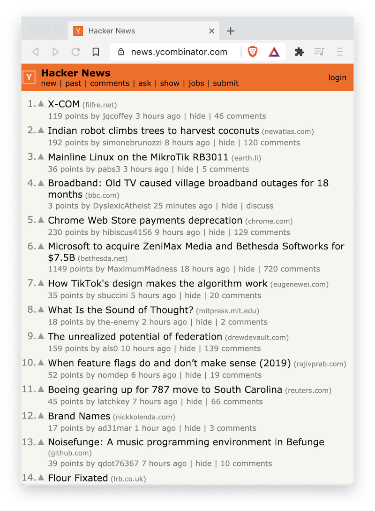
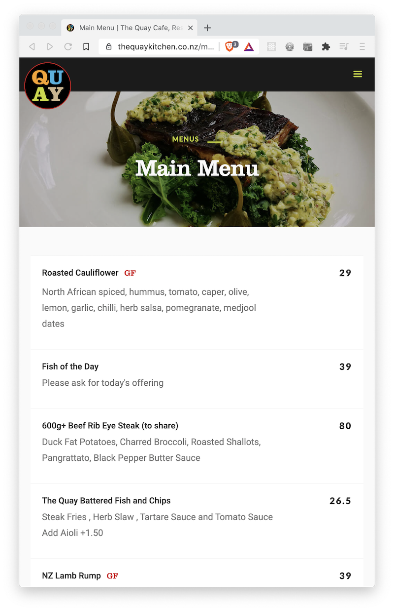

# 01 Exercise - Objects and data models

Create data in JavaScript by using JavaScript data types

---

## Brief

You will need to read and write various JavaScript data types to complete this exercise. Once you have completed that, you will be required to model your data types based on real-world concepts, such as a cafe menu or GitHub repository.

---

## Rationale

Reading and writing JavaScript data types is essential to be able to solve problems and write basic programs in JavaScript.

---

## Getting Started

1. Open the project in VS Code, and open your terminal.
2. Type `npm install`. This will install the software needed to run the automated tests.
3. The code for this exercise should go into `/Submission/script.js`.

<details>
  <summary>
   Running Automated Tests
  </summary>

This exercise has automated tests that check your work for correctness. This is similar to how freeCodeCamp tests your code before you can proceed to the next exercise.

These tests will be run when you submit your work.

**Install dependencies needed to run tests**

To start the tests, open your terminal in VS Code for this exercise, and type the following:

```bash
npm install
```

You only have to do this once.

**Starting the tests and keeping them running**

You can have the tests running as you write your code. Every time you save your `script.js` file, the tests will rerun. It will be your job to make the tests pass, one by one. To start the tests in watch mode, type the following into your terminal:

```bash
npm run test:watch
```

To stop the tests, type `control` + `c` in your terminal.

Watch this [example video of running tests](https://vimeo.com/440650789/c09e688f9b) to see how it works

**Running the tests on-demand**

If you want to run the tests on-demand, you can type the following into your terminal:

```bash
npm test
```

</details>

---

## Instructions Part A - Objects in JavaScript

1. Open `Submission/script.js`
2. Start your tests by typing `npm run test:watch` in your terminal.
   - Be sure to read _Running Automated Tests_ above if you are not sure how to run tests
3. Complete Part A by reading the comments in `script.js`

## Instructions Part B - Create data models

Model different data using JavaScript types

1.  Open `Submission/script.js`, and find the PART B section
2.  For each of the concepts, model what you think the data should be. Put the model on the corresponding variable name by removing the `null` value and replacing it with your data.
    - Leave comments in the code as to why you think the data should be modelled the way it has.
    - There are no "right or wrong" answers, or tricks. The intention is to help you practice thinking about how to model concepts using JavaScript types.
3.  Use the following images and links to model your data from. You don't have to model everything exactly as it's shown on the webpage.

### Example data model - Product Listing

To gain an understanding of how you might do some data modelling, read through the following example that models a [board game listing from Mighty Ape](https://www.mightyape.co.nz/toys/board-games/family-games/all?sort=1&q=stock%7Einstock&page=1).

The comments included in the JavaScript below are explaining why the data has been modelled the way it has, you should do this for your data models too.

```js
// Use an array for the list of board games, as they need to be sorted in a particular order,
// for example lowest price to highest, most popular first
const boardGames = [
  // Store each individual board game as an object, because each board game
  // is made up of a list of things where the order doesn't matter
  // Also using an object makes it easier to understand what each type of data is
  // because the property name acts as a label
  {
    title: "Catan: 5th Edition",
    // Split up min and max players, in case someone wants to search for
    // games that are between these two numbers. If this was a string it would make
    // comparing numbers harder
    minPlayers: 3,
    maxPlayers: 4,
    rating: 5,
    numOfReviews: 310,
    price: 82.0,
    salePrice: 73.8,
    inventory: "In Stock",
    shipping: "ships Tuesday",
    img: "https://d3fa68hw0m2vcc.cloudfront.net/aaa/115546003.jpeg",
  },
  {
    title: "Klask - Magnetic Hockey Game",
    minPlayers: 2,
    maxPlayers: 2,
    rating: 5,
    numOfReviews: 17,
    price: 71.0,
    salePrice: 56.8,
    inventory: "In Stock",
    shipping: "ships Tuesday",
    img: "https://d3fa68hw0m2vcc.cloudfront.net/699/183106313.jpeg",
  },
  {
    title: "Codenames: Card Game",
    minPlayers: 2,
    maxPlayers: 8,
    rating: 5,
    numOfReviews: 146,
    price: 34.0,
    salePrice: 30.6,
    inventory: "In Stock",
    shipping: "ships Tuesday",
    img: "https://d3fa68hw0m2vcc.cloudfront.net/26e/129143730.jpeg",
  },
];
```

### Artist

[Prince on AllMusic](https://www.allmusic.com/artist/prince-mn0000361393/discography)



### Articles

[Hacker News](https://news.ycombinator.com/)



### Menu

[Menu from The Quay](https://www.thequaykitchen.co.nz/menu/menus)



---

# Submit your Exercise

- [ ] Commits are pushed to GitHub
- [ ] Automated tests pass in GitHub

# Walkthrough video
[click here](https://www.loom.com/share/3be50b8c40f84a5aba95bc6e8c001096)
